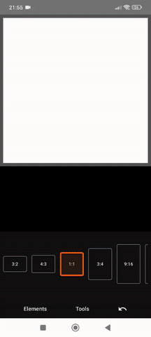

# 📸 Snap Clone – Android Image Editor App

**Snap Clone** is a mobile Android application built in **Kotlin** that offers powerful image editing tools. Inspired by Snapchat, the app allows users to import images, draw, apply filters, add text and stickers, and even create custom stickers by cropping parts of an image.

This project demonstrates advanced UI interactions, gesture handling, and image processing techniques on Android.



## ✨ Features

- 📁 **Import images** from the device gallery
- 🖼️ **Choose stickers** from the app's built-in assets
- ✂️ **Create custom stickers** by selecting an area from an image
- 🖊️ **Freehand drawing (pencil tool)**
- 🧼 **Background removal** from images
- 🎨 **Image filters**
- 🔤 **Add text** with font selection
- 🎨 **Change colors** of pencil strokes and text
- 🔄 **Move, scale, and rotate** images, stickers, and text
- 📚 **Layer management** – control element stacking order (Z-index)

## 🧪 Planned Features

- 🖊️ **Freehand drawing (pencil tool)**
- 💾 Save final images to device gallery
- 📤 Share images via messaging apps
- 💼 Save edits as a project for later modification
- 🧽 Eraser tool – remove selected areas or elements

## 🛠️ Tech Stack

- **Language:** Kotlin, Jetpack Compose, Koin, ML Kit, Coil, DataStore
- **Platform:** Android SDK
- **IDE:** Android Studio
- **Build System:** Gradle

## 🚀 Getting Started

1. Clone the repository:
   ```bash
   git clone https://github.com/nowiczenkoandrzej/snap_clone.git
